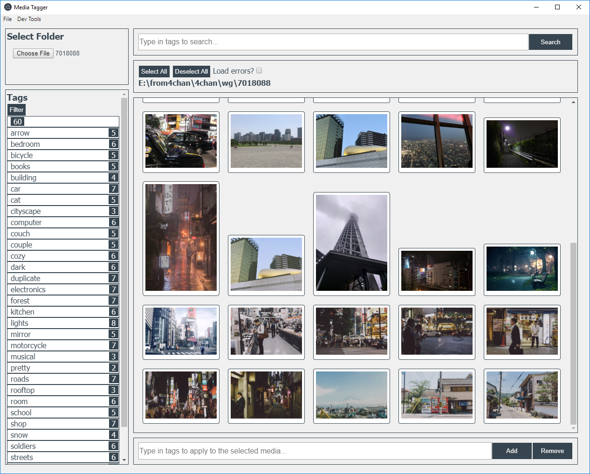

## Media Tagger
A booru-like tagging software for images and videos*.

### Current Functionality
On a selected folder:
* Add/remove tags of selected image files
* Get images by selecting or searching for tags
* Save tags to `db/tags.json`

### Current Problems
* ~~Inability to choose folders instead of typing them in manually~~
  * ~~This is caused by file permission errors~~
* No videos
* Some visual errors

An attempted port of its [incomplete Flask version](https://github.com/kittenparry/file-tagger).
